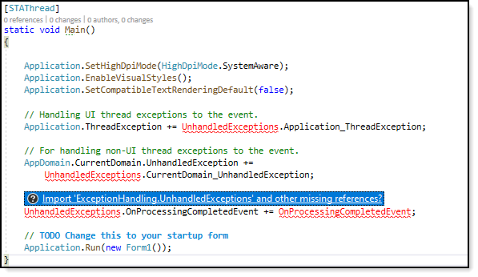
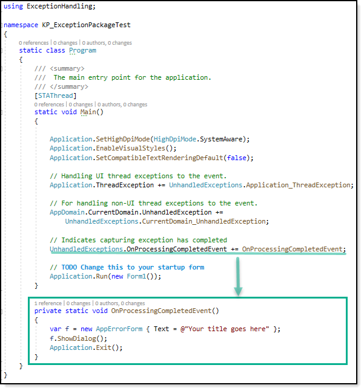

# About

Sample code sample for using NuGet package [KP.ExceptionHandling](https://www.nuget.org/packages/KP.ExceptionHandling) which provides an easy way to implement unhandled exception handling.

# Requires

- Microsoft Visual Studio 2019 or better
- Project targeting .NET 5

### Step 1

Create a .NET Core project targeting .NET 5. The project file section to setup for .NET 5 as shown below and also in the project file for this code sample

```xml
<Project Sdk="Microsoft.NET.Sdk">
	<PropertyGroup>
		<OutputType>WinExe</OutputType>
		<LangVersion>9.0</LangVersion>
		<TargetFramework>net5.0-windows</TargetFramework>
		<UseWindowsForms>true</UseWindowsForms>
	</PropertyGroup>
</Project>
```

### Step 2

Install [KP.ExceptionHandling](https://www.nuget.org/packages/KP.ExceptionHandling) from package manager command line or right click the project, manage NuGet packages, browse, type in KP.ExceptionHandling and follow the prompts.

Copy code from Program.cs in this project to your project (note errors)




Now add the following using statement

```csharp
using ExceptionHandling;
```

This will leave one issue, the event for 

```csharp
UnhandledExceptions.OnProcessingCompletedEvent
```

Add the event. In the screenshot a form in this project is use. Alternate is to show your form designed to present a message to the user something happened forcing the application to be closed or simply exit with or without a MessageBox while it is never wise to simply close the application without informing the user.

