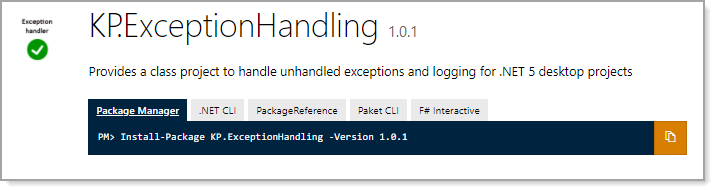
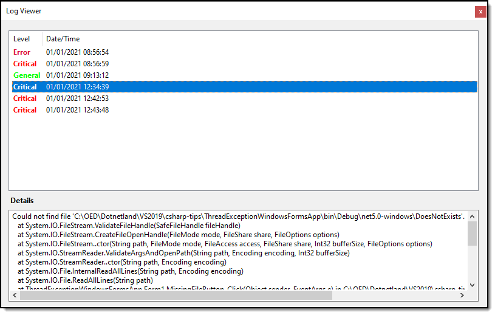

# About


Source and code sample for [KP.ExceptionHandling NuGet package](https://www.nuget.org/packages/KP.ExceptionHandling/).




### Microsoft TechNet article
https://social.technet.microsoft.com/wiki/contents/articles/54209.unhandled-runtime-exceptions-window-forms-c.aspx

### Log viewer



###  Example 

- Add the above package
- Modifiy code for OnProcessingCompletedEvent 

```csharp
using System;
using System.Collections.Generic;
using System.Diagnostics;
using System.Linq;
using System.Threading.Tasks;
using System.Windows.Forms;
using ExceptionHandling;

namespace KP_ExceptionPackageTest
{
    static class Program
    {
        /// <summary>
        ///  The main entry point for the application.
        /// </summary>
        [STAThread]
        static void Main()
        {

            Application.SetHighDpiMode(HighDpiMode.SystemAware);
            Application.EnableVisualStyles();
            Application.SetCompatibleTextRenderingDefault(false);

            // Handling UI thread exceptions to the event.
            Application.ThreadException += UnhandledExceptions.Application_ThreadException;

            // For handling non-UI thread exceptions to the event. 
            AppDomain.CurrentDomain.UnhandledException +=
                UnhandledExceptions.CurrentDomain_UnhandledException;

            // Indicates capturing exception has completed
            UnhandledExceptions.OnProcessingCompletedEvent += OnProcessingCompletedEvent;

            // TODO Change this to your startup form
            Application.Run(new Form1());
        }

        private static void OnProcessingCompletedEvent()
        {
            var f = new AppErrorForm { Text = @"Your title goes here" };
            f.ShowDialog();
            Application.Exit();
        }
    }
}

```